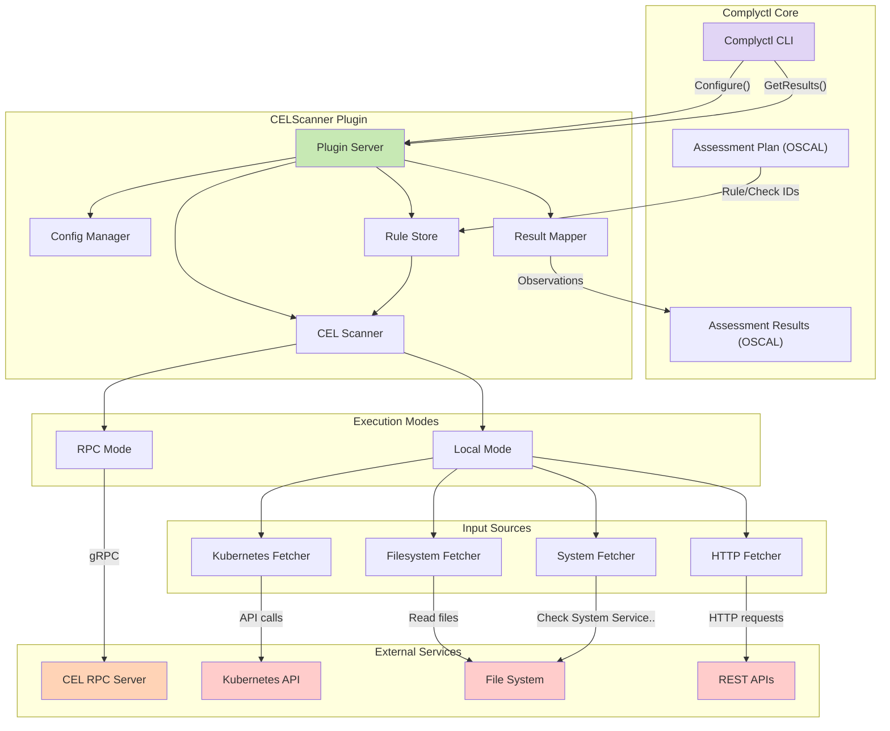
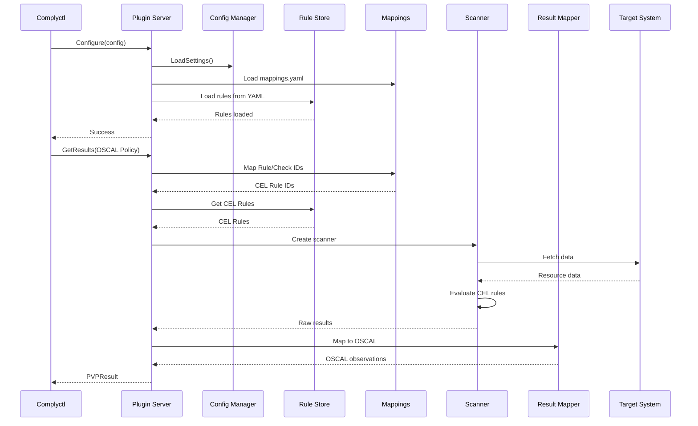

# CELScanner Plugin for Complyctl

## Overview

The **celscanner-plugin** extends complyctl's capabilities to use CEL (Common Expression Language) for compliance validation. This plugin integrates with the CEL Go Scanner library and optionally with the CEL RPC Server to provide flexible, policy-as-code compliance checking using the OSCAL (Open Security Controls Assessment Language) framework.

## YAML-Based Rule Storage

The plugin includes a comprehensive YAML-based rule storage system that provides:

### Rule Management Features
- **Individual Storage**: Each rule stored as a separate YAML file for easy version control
- **Batch Operations**: Import and export multiple rules at once
- **Flexible Filtering**: Query rules by category, severity, tags, or check ID
- **Automatic Conversion**: Seamless conversion between stored format and CEL scanner objects

### Rule Format Example
```yaml
id: pod-security-context
name: Pod Security Context Check
description: Ensures pods have a security context defined with proper restrictions
expression: 'pods.items.all(item, has(item.spec.securityContext) && has(item.spec.securityContext.runAsNonRoot) && item.spec.securityContext.runAsNonRoot == true)'
inputs:
  - name: pods
    kubernetes:
      apiGroup: ""
      version: v1
      resourceType: pods
      namespace: ""
      name: ""
tags: 
  - security
  - compliance
  - pods
category: pod-security
severity: HIGH
extensions:
  compliance_framework: CIS
  control_id: "1.1.1"
  remediation: "Ensure all pods have security context with runAsNonRoot set to true"
check_id: pod-security-context
```

### Additional Rule Examples

#### File Permission Check
```yaml
id: kubeconfig-file-permissions
name: Kubeconfig File Permissions Check
description: Ensures the kubeconfig file has restrictive permissions (600)
expression: |
  has(kubeconfig.mode) && kubeconfig.mode == "-rw-------"
inputs:
  - name: kubeconfig
    file:
      path: /etc/kubernetes/kubeconfig
      format: text
      recursive: false
      checkPermissions: true
category: file-security
severity: CRITICAL
extensions:
  compliance_framework: CIS
  control_id: "1.1.13"
```

#### System Service Check
```yaml
id: sshd-service-running
name: SSH Daemon Service Running Check
description: Verifies SSH daemon service is currently active and running
expression: 'service.success && contains(service.output, "active")'
inputs:
  - name: service
    system:
      command: systemctl
      service: sshd
      args:
        - is-active
        - sshd
category: system-services
severity: CRITICAL
```

### Rule Store API Usage
```go
// Create a new rule store
store, err := NewRuleStore("/path/to/rules")

// Save a rule
rule := &StoredRule{
    ID: "custom-check",
    Name: "Custom Security Check",
    Expression: "resource.status == 'secure'",
    // ... other fields
}
store.Save(rule)

// List rules with filtering
rules := store.List(map[string]string{
    "category": "security",
    "severity": "HIGH",
})

// Export rules
store.ExportRules([]string{"rule1", "rule2"}, "export.yaml")

// Import rules
store.ImportRules("rules.yaml", false) // false = skip existing
```

## Architecture Design

### High-Level Architecture

The CELScanner Plugin follows a modular architecture that seamlessly integrates with complyctl's plugin framework while providing flexible execution modes and input sources.



### Component Architecture

#### 1. **Plugin Server (Core Component)**
The Plugin Server is the main entry point that implements the `policy.Provider` interface:

- **Responsibilities**:
  - Handles gRPC communication with complyctl
  - Maps OSCAL Rule/Check IDs to CEL rules via mappings
  - Manages execution modes (local vs RPC)
  - Coordinates all sub-components

- **Key Methods**:
  - `Configure()`: Initializes plugin settings, loads mappings and rule store
  - `GetResults()`: Loads CEL rules from store, executes scans, and returns compliance results

#### 2. **Config Manager**
Manages all plugin configuration:

- **Configuration Categories**:
  - **Files**: Workspace paths, mapping files, output locations
  - **Parameters**: Target details, profiles, namespaces
  - **CEL Server**: RPC connection settings, TLS configuration
  - **Features**: Enable/disable various input sources
  - **Scanner**: Debug settings, resource filters

#### 3. **Rule Store**
Manages YAML-based CEL rule storage and retrieval:

- **Responsibilities**:
  1. Loads CEL rules from YAML files in the rules directory
  2. Converts stored rules to CEL scanner format
  3. Handles input unmarshaling from YAML to proper types
  4. Maps OSCAL Rule/Check IDs to stored CEL rules

- **Key Features**:
  - Individual YAML files per rule for version control
  - Support for Kubernetes, file, system, and HTTP inputs
  - Flexible mapping configuration (stored rules or inline)
  - Automatic type conversion for different input types

#### 4. **CEL Scanner**
Executes CEL expressions against targets:

- **Execution Modes**:
  - **Local Mode**: Direct evaluation using embedded CEL engine
  - **RPC Mode**: Delegates to CEL RPC Server for evaluation
  - **Hybrid Mode**: Chooses mode based on rule requirements

- **Scanner Creation**:
  ```go
  // Local scanner with composite fetcher
  scanner := celscanner.NewScanner(compositeFetcher, logger)
  
  // RPC scanner using gRPC client
  scanner := createRPCScanner(celRPCClient)
  ```

#### 5. **Result Mapper**
Transforms CEL evaluation results to OSCAL format:

- **Mapping Logic**:
  - CEL `CheckResultPass` → OSCAL `RESULT_PASS`
  - CEL `CheckResultFail` → OSCAL `RESULT_FAILURE`
  - CEL `CheckResultError` → OSCAL `RESULT_ERROR`
  
- **Result Structure**:
  - Observations by check ID
  - Subject details (target info)
  - Timestamps and methods
  - Evidence references

### Data Flow Architecture

1. **Configuration Flow**:
   ```
   Manifest → Configure() → Config Manager → Load Mappings → Load Rule Store
   ```

2. **Rule Loading Flow**:
   ```
   OSCAL Assessment Plan → Extract Rule/Check IDs → Mapping File → Rule Store → CEL Rules
   ```

3. **Execution Flow**:
   ```
   CEL Rules → Scanner → Fetchers → Target Systems → Results
   ```

4. **Results Flow**:
   ```
   Raw Results → Result Mapper → OSCAL Observations → Assessment Results
   ```

### Plugin Integration Architecture

The plugin uses HashiCorp's go-plugin framework for secure communication:

```go
// Plugin registration
pluginMap := map[string]plugin.Plugin{
    plugin.PVPPluginName: &plugin.PVPPlugin{Impl: complianceSDKPlugin},
}

// gRPC communication
service PolicyEngine {
    rpc Configure(ConfigureRequest) returns (ConfigureResponse);
    rpc Generate(PolicyRequest) returns (GenerateResponse);
    rpc GetResults(PolicyRequest) returns (ResultsResponse);
}
```

### Security Architecture

1. **Plugin Isolation**:
   - Runs as separate process
   - Communication via gRPC only
   - No shared memory with complyctl

2. **Authentication & Authorization**:
   - TLS support for CEL RPC Server
   - Kubernetes RBAC for K8s fetcher
   - File permissions for filesystem access

3. **Data Protection**:
   - Sensitive data never logged
   - Results stored with restricted permissions
   - Optional encryption for stored rules

### Extensibility Architecture

The plugin is designed for easy extension:

1. **New Input Sources**:
   - Implement the Fetcher interface
   - Add configuration options
   - Register in scanner builder

2. **Custom Mappings**:
   - JSON-based mapping files
   - Programmatic mapping functions
   - Future: Plugin-based mappers

3. **Result Formats**:
   - Current: OSCAL Assessment Results
   - Extensible to other formats via interfaces

### Workflow Sequence Diagram



### Directory Structure

```
celscanner-plugin/
├── main.go                    # Plugin entry point
├── go.mod                     # Go module definition
├── Makefile                   # Build and test automation
├── README.md                  # This documentation
│
├── server/                    # Plugin server implementation
│   ├── server.go             # Core plugin logic
│   ├── server_test.go        # Unit tests
│   ├── rulestore.go          # YAML rule storage
│   └── rulestore_test.go     # Rule store tests
│
├── docs/                      # Documentation
│   ├── mapping-system.md     # Mapping system details
│   ├── kubeconfig-handling.md # Kubeconfig documentation
│   └── yaml-rule-storage.md  # Rule storage details
│
└── test/                      # Integration tests
    ├── integration_test.go   # Full workflow tests
    └── fixtures/             # Test data
```

**Workspace Structure** (created at runtime):
```
workspace/
├── mappings.yaml             # Rule ID to CEL rule mappings
├── rules/                    # CEL rules in YAML format
│   ├── pod-security-context.yaml
│   ├── network-policy-compliance.yaml
│   └── kubeconfig-permissions.yaml
└── celscanner/
    ├── policy/              # Generated policy files
    └── results/             # Scan results
        └── cel-results.yaml
```

### Deployment Architecture

The CELScanner Plugin supports multiple deployment scenarios:

#### 1. **Standalone Deployment**
```
┌─────────────┐     ┌───────────────────┐
│  Complyctl  │────▶│ CELScanner Plugin │
└─────────────┘     └───────────────────┘
                             │
                    ┌────────┴────────┐
                    ▼                 ▼
              Local Scanner      Target System
```


#### 2. **Kubernetes Deployment**
```yaml
apiVersion: v1
kind: ConfigMap
metadata:
  name: celscanner-config
data:
  config.yaml: |
    enable_kubernetes: true
    use_rpc_server: true
    cel_server_address: cel-rpc-server:50051
---
apiVersion: batch/v1
kind: Job
metadata:
  name: compliance-scan
spec:
  template:
    spec:
      serviceAccountName: celscanner
      containers:
      - name: complyctl
        image: complytime/complyctl:latest
        command: ["complyctl", "scan", "-m", "/config/manifest.yaml"]
        volumeMounts:
        - name: config
          mountPath: /config
      volumes:
      - name: config
        configMap:
          name: celscanner-config
```

### Comparison with OpenSCAP Plugin

| Feature | OpenSCAP Plugin | CELScanner Plugin |
|---------|----------------|-------------------|
| **Expression Language** | XCCDF/OVAL | CEL (Common Expression Language) |
| **Execution Model** | System binary (oscap) | Embedded or RPC |
| **Target Systems** | Linux systems | Kubernetes, APIs, Files, Systems |
| **Rule Format** | XML-based | JSON/YAML with CEL |
| **Performance** | Process-based | In-memory evaluation |
| **Extensibility** | Limited to SCAP | Highly extensible |
| **Cloud Native** | Limited | First-class support |
| **Custom Rules** | Complex XML | Simple CEL expressions |
| **AI Integration** | Not supported | Future: LLM rule generation |

## Core Interfaces

The plugin implements the `policy.Provider` interface from `compliance-to-policy-go/v2`:

```go
type Provider interface {
    Configure(configMap map[string]string) error
    Generate(policy Policy) error
    GetResults(policy Policy) (PVPResult, error)
}
```

### Internal Interfaces

```go
// Fetcher interface for data sources
type Fetcher interface {
    FetchInputs(inputs []Input, metadata map[string]interface{}) (map[string]interface{}, error)
}

// Logger interface for plugin logging
type Logger interface {
    Debug(msg string, args ...interface{})
    Info(msg string, args ...interface{})
    Warn(msg string, args ...interface{})
    Error(msg string, args ...interface{})
}

// RuleMapper interface for OSCAL to CEL conversion
type RuleMapper interface {
    MapCheck(checkName string) (expression string, inputs []Input)
    LoadMappings(path string) error
}
```

## Features

### 1. Multiple Execution Modes
- **Local Mode**: Uses embedded CEL scanner for direct evaluation
- **RPC Mode**: Connects to CEL RPC Server for distributed scanning
- **Hybrid Mode**: Can use both modes based on rule requirements

### 2. Multiple Input Sources
- **Kubernetes**: Scan Kubernetes resources (Pods, Deployments, Services, etc.)
- **Filesystem**: Validate configuration files and system files
- **HTTP**: Check REST API endpoints and responses
- **System**: Limited to service status checks only (systemctl, getenforce) for security

### 3. OSCAL Integration
- Converts OSCAL Component Definitions to CEL rules
- Maps CEL validation results back to OSCAL Assessment Results
- Supports OSCAL parameters and rule metadata

## Configuration

The plugin accepts configuration through the manifest file:

```yaml
plugin:
  name: compliance-sdk-plugin
  config:
    # Workspace configuration
    workspace: /tmp/complyctl-workspace
    
    # Target information
    target_name: "my-kubernetes-cluster"
    target_type: "kubernetes-cluster"
    target_id: "cluster-001"
    
    # Feature flags
    enable_kubernetes: true
    enable_filesystem: true
    enable_http: false
    enable_system: false
    
    # CEL RPC Server (optional)
    use_rpc_server: true
    cel_server_address: "localhost:50051"
    cel_server_timeout: 30
    
    # Scanner configuration
    enable_debug_logging: false
    include_namespaces: "default,kube-system"
    resource_types: "pods,deployments,services"
```

## How It Works

### 1. Configuration Phase

When complyctl calls `Configure()`:

1. The plugin loads configuration settings
2. Loads the mapping file (e.g., `mappings.yaml`) 
3. Initializes the rule store from the `rules/` directory
4. Sets up Kubernetes clients if enabled
5. Configures RPC client if using CEL Server mode

### 2. Scan Phase

When complyctl calls `GetResults()`:

1. The plugin extracts Rule/Check IDs from the OSCAL assessment plan
2. Maps these IDs to CEL rules using the mapping configuration
3. Retrieves the corresponding CEL rules from the rule store
4. Creates a scanner based on configuration:
   - Local scanner with appropriate fetchers
   - Or RPC client connection
5. Executes all CEL rules against the target
6. Converts results to OSCAL observations

### 3. Result Mapping

CEL results are mapped to OSCAL as follows:
- `CheckResultPass` → `RESULT_PASS`
- `CheckResultFail` → `RESULT_FAILURE`
- `CheckResultError` → `RESULT_ERROR`

Each observation includes:
- The original check ID
- Execution timestamp
- Target information (name, type, ID)
- Pass/fail status and reasons

## Integration with CEL RPC Server

When using the CEL RPC Server mode:

1. The plugin connects to the server via gRPC
2. Rules can reference the server's rule library
3. Test cases can be executed for validation
4. Results include detailed compliance information

## Example Workflow

```bash
# 1. Create CEL rules in YAML format
cat > workspace/rules/pod-security-context.yaml <<EOF
id: pod-security-context
name: Pod Security Context Check
expression: 'pods.items.all(item, has(item.spec.securityContext))'
inputs:
  - name: pods
    kubernetes:
      apiGroup: ""
      version: v1
      resourceType: pods
severity: HIGH
check_id: pod-security-context
EOF

# 2. Create mapping configuration
cat > workspace/mappings.yaml <<EOF
version: "1.0"
mappings:
  pod-security-context:
    type: stored_rules
    rule_ids:
      - pod-security-context
EOF

# 3. Configure the plugin in your manifest
cat > manifest.yaml <<EOF
assessment-plan: assessment-plan.json
plugins:
  - name: celscanner-plugin
    config:
      workspace: ./workspace
      enable_kubernetes: true
      target_name: production-cluster
      mapping_file: mappings.yaml
EOF

# 4. Run compliance scan
complyctl scan -m manifest.yaml

# 5. View results
cat workspace/celscanner/results/cel-results.yaml
```

## System Service Status Checks

For security reasons, system command execution is limited to service status checks only. The plugin supports:

- **Service Status**: Check if a service is running (`systemctl is-active <service>`)
- **Service Enabled**: Check if a service is enabled (`systemctl is-enabled <service>`)
- **SELinux Status**: Check SELinux enforcement mode (`getenforce`)

Example system service rules:
```yaml
id: sshd-service-enabled
name: SSH Service Enabled Check
description: Ensures SSH daemon service is enabled
expression: 'service.success && contains(service.output, "enabled")'
inputs:
  - name: service
    system:
      command: systemctl
      args:
        - is-enabled
        - sshd
severity: HIGH
check_id: sshd-service-enabled

---
id: firewalld-running
name: Firewalld Running Check  
description: Ensures firewalld service is active
expression: 'service.success && contains(service.output, "active")'
inputs:
  - name: service
    system:
      command: systemctl
      args:
        - is-active
        - firewalld
severity: CRITICAL
check_id: firewalld-running
```

### Security Considerations

- System commands are restricted to specific service status commands
- No arbitrary command execution is allowed
- Commands are validated before execution
- Results are parsed to extract only status information

### Implementation Details

The plugin parses system inputs from YAML and creates the appropriate CEL scanner inputs:
- Service status checks: `command: systemctl, args: [is-active, service-name]`
- Service enabled checks: `command: systemctl, args: [is-enabled, service-name]`
- SELinux checks: `command: getenforce, args: []`
- Direct service checks: `service: service-name` (for built-in service checks)

The expressions validate both command success and output content:
```cel
service.success && contains(service.output, "active")
```

This ensures that:
1. The command executed successfully (`service.success`)
2. The output contains the expected status string

## CEL Expression Mapping System

The plugin uses an advanced mapping system to convert OSCAL RuleSets to CEL rules:

### Key Features
- **One-to-Many Mapping**: One RuleSet can map to multiple CEL rules
- **Flexible Sources**: Use stored rules or inline definitions
- **Hierarchical Lookup**: Map by RuleSet ID or individual Check IDs

### Mapping Configuration Example
```yaml
# mappings.yaml
version: "1.0"
mappings:
  # Map OSCAL Rule/Check ID to stored CEL rules
  pod-security-context:
    type: stored_rules
    rule_ids:
      - pod-security-context
      
  namespace-network-policy-compliance:
    type: stored_rules
    rule_ids:
      - namespace-network-policy-compliance
  
  kubeconfig-file-permissions:
    type: stored_rules
    rule_ids:
      - kubeconfig-file-permissions

# Severity mappings for different check types
severity_mappings:
  security: HIGH
  compliance: CRITICAL
  network-security: HIGH
  pod-security: HIGH
  file-security: CRITICAL
```

See [Mapping System Documentation](docs/mapping-system.md) for detailed information.

## Development

### Building the Plugin

```bash
cd cmd/celscanner-plugin
go build -o celscanner-plugin
```

### Testing

The plugin includes comprehensive test coverage with both unit tests and integration tests.

#### Unit Tests

Run unit tests with mocked dependencies:

```bash
make test
```

Run tests with coverage report:

```bash
make test-coverage
```

#### Integration Tests

Integration tests require access to a live Kubernetes cluster. They automatically discover kubeconfig using standard Kubernetes conventions (KUBECONFIG environment variable, ~/.kube/config, or in-cluster config).

Run integration tests:

```bash
make test-k8s
```

Run with specific kubeconfig:

```bash
make test-k8s-config    # Uses kubeconfig from KUBECONFIG env var or ~/.kube/config
# or
KUBECONFIG=/path/to/kubeconfig make test-k8s
```

Run all tests (unit + integration):

```bash
make test-all
```

#### Test Features

1. **Mock Testing**: Unit tests use mocked Kubernetes clients and scanner
2. **Live Cluster Testing**: Integration tests validate against real Kubernetes resources
3. **YAML Format Testing**: Verifies correct YAML serialization/deserialization
4. **Custom Mapping Testing**: Tests loading and applying custom CEL expression mappings
5. **Performance Testing**: Includes benchmarks for rule generation

#### Test Workspace Configuration

Tests use a temporary workspace by default to avoid modifying the examples directory. You can override this behavior:

```bash
# Use default temp workspace (recommended)
go test ./server

# Use a specific workspace directory
TEST_WORKSPACE=/path/to/workspace go test ./server

# Integration tests with custom workspace
TEST_WORKSPACE=/tmp/my-test-workspace make test-k8s
```

The test workspace setup:
- Creates a temporary directory by default
- Copies example rules and mappings from `../examples`
- Creates required subdirectories (`celscanner/policy`, `celscanner/results`, `rules`)
- Cleans up automatically after tests complete

#### Writing Tests

When adding new features, ensure to:
- Add unit tests in `*_test.go` files
- Add integration tests in `*_integration_test.go` files with `//go:build integration` tag
- Test both success and failure scenarios
- Include YAML format validation for any data structures

### Adding New Fetchers

To add support for new input sources:

1. Implement the fetcher in the celscanner library
2. Add configuration options in `config/config.go`
3. Update the scanner creation logic in `server/server.go`

## Future Enhancements

1. **Dynamic Rule Generation**: Use AI/LLM to generate CEL expressions from natural language policies
2. **Rule Library Integration**: Direct integration with CEL RPC Server's rule library
3. **Multi-cluster Support**: Scan multiple Kubernetes clusters in parallel
4. **Policy Templates**: Pre-built CEL rules for common compliance frameworks
5. **Real-time Monitoring**: Continuous compliance checking with webhooks

## License

This plugin is licensed under the Apache-2.0 License.